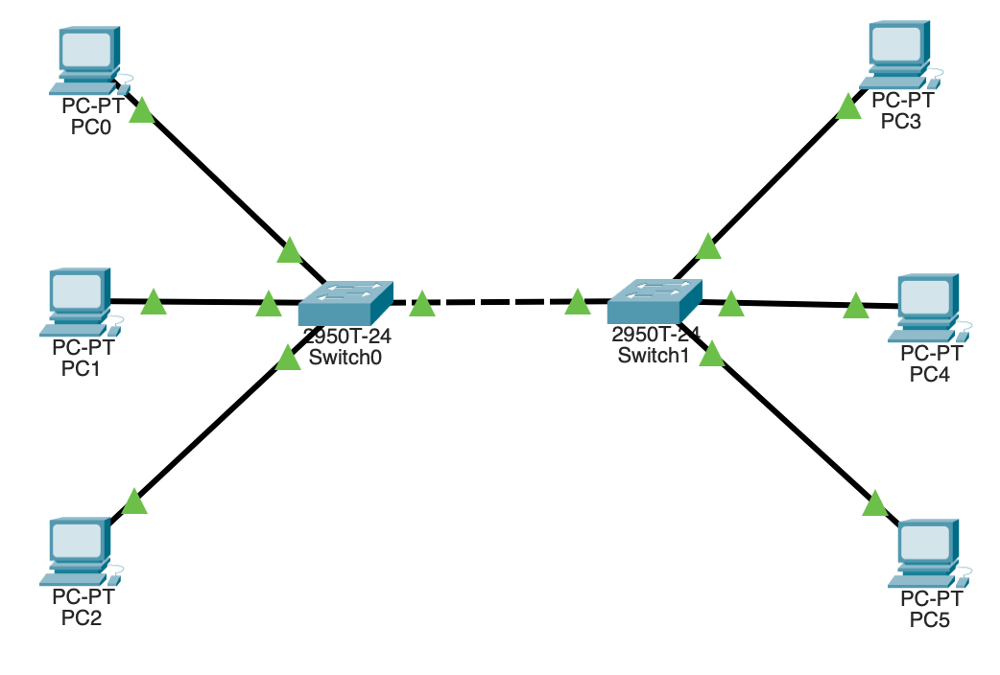
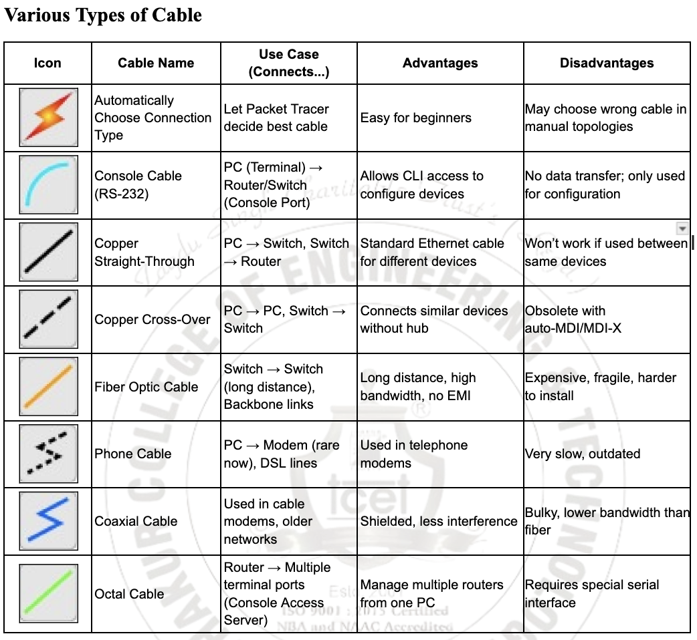

### **Network Design (Various Cables 2 Router , 6 PC)**

#### **1. Group 1 – Left side (Switch0)**

Connect:

* `PC0 → Switch0` (use FastEthernet cable)
* `PC1 → Switch0`
* `PC2 → Switch0`

#### 2. **Group 2 – Right side (Switch1)**

Connect:

* `PC3 → Switch1`
* `PC4 → Switch1`
* `PC5 → Switch1`

#### 3. **Connect the two switches**

* Use a **crossover cable** (or straight-through, Packet Tracer will auto-correct)
* Connect: `Switch0 (FastEthernet0/24)` → `Switch1 (FastEthernet0/24)`

---

### **Assign IP Addresses (Example Setup)**

| Device | Interface     | IP Address  | Subnet Mask   |
| ------ | ------------- | ----------- | ------------- |
| PC0    | FastEthernet0 | 192.168.1.1 | 255.255.255.0 |
| PC1    | FastEthernet0 | 192.168.1.2 | 255.255.255.0 |
| PC2    | FastEthernet0 | 192.168.1.3 | 255.255.255.0 |
| PC3    | FastEthernet0 | 192.168.1.4 | 255.255.255.0 |
| PC4    | FastEthernet0 | 192.168.1.5 | 255.255.255.0 |
| PC5    | FastEthernet0 | 192.168.1.6 | 255.255.255.0 |

All devices are now in the same **LAN (192.168.1.0/24)** and can communicate through the switches.

---

### **Testing Connectivity**

1. Click any PC → Desktop tab → **Command Prompt**
2. Type:

   ```
   ping 192.168.1.6
   ```

   (example: from PC0 to PC5)
3. You should see replies — meaning all devices are connected successfully.

### **Theroy Data**
