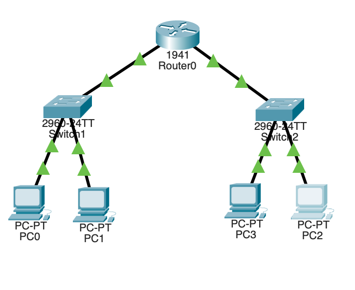

### **Simple Networking Devices (4 PC , 2 Switchs , 1 Router)**

## **1. PERSONAL COMPUTER (PC)**

1. A **PC** (end device) is used by the user to send and receive data over the network.
2. It works on **Layer-7 (Application Layer)** but includes all layers of the **OSI Model** for communication.
3. Has a **Network Interface Card (NIC)** to connect physically to a network (wired or wireless).
4. Assigned an **IP address, subnet mask, and gateway** for network identification and communication.
5. Communicates with other devices using protocols like **HTTP, FTP, DNS, ICMP (Ping)**, etc.
6. Can act as a **client or server** depending on the network configuration.
7. Uses **operating system network utilities** (e.g., `ping`, `tracert`, `ipconfig`, `ifconfig`) for testing and troubleshooting.

---

## **2. SWITCH**

1. A **Switch** is a Layer-2 (Data Link Layer) device used to connect multiple devices within the **same local network (LAN)**.
2. It uses **MAC addresses** to forward frames to the correct destination port, reducing network collisions.
3. Operates in **Full-Duplex mode**, allowing simultaneous send and receive operations.
4. Builds and maintains a **MAC address table** to remember which device is on which port.
5. Supports **VLANs (Virtual LANs)** for logical segmentation of networks.
6. Unlike a hub, a switch sends data only to the intended device, improving **network efficiency** and **bandwidth usage**.
7. Can operate at Layer 3 (known as a **Layer-3 Switch**) to perform limited routing functions.

---

## **1. ROUTER**

1. A **Router** is a Layer-3 (Network Layer) device that connects **multiple networks** and directs data packets based on their **IP addresses**.
2. It determines the **best path** for data to travel using **routing tables** and **routing protocols** (e.g., RIP, OSPF, EIGRP).
3. Routers can connect **different LANs, WANs, or VLANs** together.
4. They use **logical addressing (IP address)** rather than MAC addresses for forwarding.
5. Provides **Network Address Translation (NAT)** and **Dynamic Host Configuration Protocol (DHCP)** functions in many setups.
6. Each router interface (Ethernet, Serial, etc.) belongs to a different **network segment**.
7. Can perform **packet filtering and traffic control**, improving network security.

---

## **Network Topology Overview**


**Devices:**

- 1 Router → `Router0 (Cisco 1941)`
- 2 Switches → `Switch1` and `Switch2`
- 4 PCs → `PC0`, `PC1`, `PC2`, `PC3`

---

## ⚙️ **1. Connections**

| From    | To      | Cable Type             | Interface Used                           |
| ------- | ------- | ---------------------- | ---------------------------------------- |
| Router0 | Switch1 | Straight-through cable | `GigabitEthernet0/0` ↔ `FastEthernet0/1` |
| Router0 | Switch2 | Straight-through cable | `GigabitEthernet0/1` ↔ `FastEthernet0/1` |
| PC0     | Switch1 | Straight-through cable | `FastEthernet0` ↔ `FastEthernet0/2`      |
| PC1     | Switch1 | Straight-through cable | `FastEthernet0` ↔ `FastEthernet0/3`      |
| PC2     | Switch2 | Straight-through cable | `FastEthernet0` ↔ `FastEthernet0/2`      |
| PC3     | Switch2 | Straight-through cable | `FastEthernet0` ↔ `FastEthernet0/3`      |

---

## **2. Assign IP Addressing**

| Device          | Interface          | IP Address  | Subnet Mask   | Default Gateway |
| --------------- | ------------------ | ----------- | ------------- | --------------- |
| Router0 (LAN 1) | GigabitEthernet0/0 | 192.168.1.1 | 255.255.255.0 | —               |
| Router0 (LAN 2) | GigabitEthernet0/1 | 192.168.2.1 | 255.255.255.0 | —               |
| PC0             | FastEthernet0      | 192.168.1.2 | 255.255.255.0 | 192.168.1.1     |
| PC1             | FastEthernet0      | 192.168.1.3 | 255.255.255.0 | 192.168.1.1     |
| PC2             | FastEthernet0      | 192.168.2.2 | 255.255.255.0 | 192.168.2.1     |
| PC3             | FastEthernet0      | 192.168.2.3 | 255.255.255.0 | 192.168.2.1     |

---

## **3. Router Configuration (in CLI)**

in Router GigabitEthernet dont forget to on (both 0 and 1) this gives no shutdown state
On **Router0**, enter the following commands:

```bash
Router> enable
Router# configure terminal

Router(config)# interface gigabitEthernet0/0
Router(config-if)# ip address 192.168.1.1 255.255.255.0
Router(config-if)# no shutdown
Router(config-if)# exit

Router(config)# interface gigabitEthernet0/1
Router(config-if)# ip address 192.168.2.1 255.255.255.0
Router(config-if)# no shutdown
Router(config-if)# exit

Router(config)# end
Router# write memory
```

---

## **4. Configure PCs**

For each PC:

1. Go to **Desktop → IP Configuration**
2. Enter IP address, Subnet Mask, and Default Gateway as shown in the table above.

---

## **5. Test Connectivity**

- From `PC0`, open **Command Prompt** → type:

  ```
  ping 192.168.1.3   (to PC1)
  ping 192.168.2.2   (to PC2)
  ping 192.168.2.3   (to PC3)
  ```

---

## **Concept Summary**

| Component    | Function                                                           |
| ------------ | ------------------------------------------------------------------ |
| **Router**   | Connects two networks (192.168.1.0/24 and 192.168.2.0/24)          |
| **Switches** | Connect multiple PCs in each LAN                                   |
| **PCs**      | End devices used to test communication                             |
| **Cables**   | Straight-through for all (since connecting different device types) |
