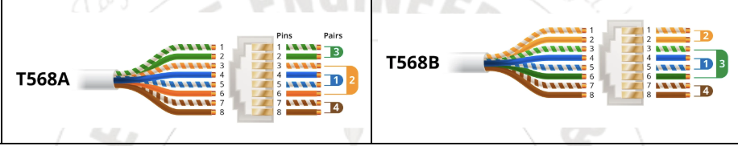
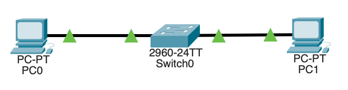

## **Experiment: Ethernet Cable Crimping (Straight and Cross Cable)**

### **Theory:**

1. **Ethernet Crimping** is the process of attaching **RJ-45 connectors** to both ends of a **UTP (Unshielded Twisted Pair)** cable so that it can be used for data transmission between network devices.
2. Ethernet cables are based on **Category 5e / Category 6** (Cat5e/Cat6) twisted-pair cables, containing **4 pairs (8 wires)** with specific color codes.
3. The two most common wiring standards are:

   - **T568A**
   - **T568B**
     These define the order of wire colors for proper connectivity.

4. The color sequence must be **consistent** to ensure proper transmission (Tx) and reception (Rx) signals.
5. **Straight-through Cable**:

   - Both ends use the **same wiring standard** (T568A–T568A or T568B–T568B).
   - Used to connect **different devices** (e.g., PC ↔ Switch, Switch ↔ Router).

6. **Cross-over Cable**:

   - One end uses **T568A**, and the other end uses **T568B**.
   - Used to connect **similar devices** (e.g., PC ↔ PC, Switch ↔ Switch).

7. The **crimping tool** is used to press and secure the wires into the RJ-45 connector pins, ensuring proper contact.
8. After crimping, the cable is tested using a **LAN cable tester** to check continuity and correct pin configuration.
9. Proper crimping ensures **reliable data transfer**, reduced interference, and minimal signal loss.

---

### **Pin Configuration:**

| Pin | **T568A Color** | **T568B Color** |
| --- | --------------- | --------------- |
| 1   | White/Green     | White/Orange    |
| 2   | Green           | Orange          |
| 3   | White/Orange    | White/Green     |
| 4   | Blue            | Blue            |
| 5   | White/Blue      | White/Blue      |
| 6   | Orange          | Green           |
| 7   | White/Brown     | White/Brown     |
| 8   | Brown           | Brown           |


---

### **Apparatus / Components:**

- Cat5e or Cat6 UTP Cable
- RJ-45 Connectors
- Crimping Tool
- Cable Stripper
- LAN Cable Tester

---

### **Procedure:**

1. Strip about 1 inch of the UTP cable sheath.
2. Untwist and straighten the wire pairs.
3. Arrange wires as per **T568A** or **T568B** color code.
4. Cut all wires evenly and insert into the RJ-45 connector.
5. Crimp the connector firmly using the **crimping tool**.
6. Repeat the process for the other end of the cable.
7. Test using a **LAN cable tester** to verify connectivity.

---

## **Ethernet Crimping in Cisco Packet Tracer**

### **Objective:**

To understand and simulate the use of **Straight-through** and **Crossover** Ethernet cables between different network devices.

---

## **What You Can Do in CPT**

### **1. Simulate Straight-Through Cable Connections**

**Purpose:** Connect _different devices_ (like PC ↔ Switch, Switch ↔ Router).

**Steps:**

1. Open Cisco Packet Tracer.
2. Drag and drop:

   - 2 PCs (`End Devices`)
   - 1 Switch (`2960-24TT`)

3. Connect them using:

   ```
   Connections → Copper Straight-Through cable
   ```

---

### **2. Simulate Crossover Cable Connections**

**Purpose:** Connect _similar devices_ (like PC ↔ PC, Switch ↔ Switch).
**Steps:**
1. Use:

   ```
   Connections → Copper Cross-Over cable
   ```

2. Connect PC0 ↔ PC1 (or Switch0 ↔ Switch1).
3. Observe that both link lights turn green.
---

### **3. Assign IP Addresses**
For PCs connected via cable:
1. Click on each PC → **Desktop → IP Configuration**
2. Example setup:

   ```
   PC0: 192.168.1.1  / 255.255.255.0
   PC1: 192.168.1.2  / 255.255.255.0
   ```
3. Ping test:

   ```
   PC0 → Command Prompt → ping 192.168.1.2
   ```
---

### **4. Experiment with Wrong Cable Type**

Try connecting:

- PC ↔ Switch using _Cross-over cable_
- PC ↔ PC using _Straight-through cable_
---

### **5. Document the Color Codes**

Inside CPT, you can’t see the wire colors — but you can:

- Write a note on the workspace:

  ```
  T568A → White/Green, Green, White/Orange, Blue, White/Blue, Orange, White/Brown, Brown
  T568B → White/Orange, Orange, White/Green, Blue, White/Blue, Green, White/Brown, Brown
  ```

- Label each cable accordingly for demonstration.

---

## 🧠 **Concepts You Demonstrate in CPT**

| Concept                        | Demonstrated By                      |
| ------------------------------ | ------------------------------------ |
| Straight vs Cross Cable        | Connecting different/similar devices |
| Cable Functionality            | Green link lights + Ping test        |
| Logical Connectivity           | IP addressing + Communication        |
| Importance of Wiring Standards | Wrong cable type = connection fail   |

---

### **Optional Add-ons for Report:**

**Aim:** To simulate Ethernet cable crimping and verify connectivity using Cisco Packet Tracer.
**Result:** The straight-through and crossover cables were successfully tested between suitable devices.
