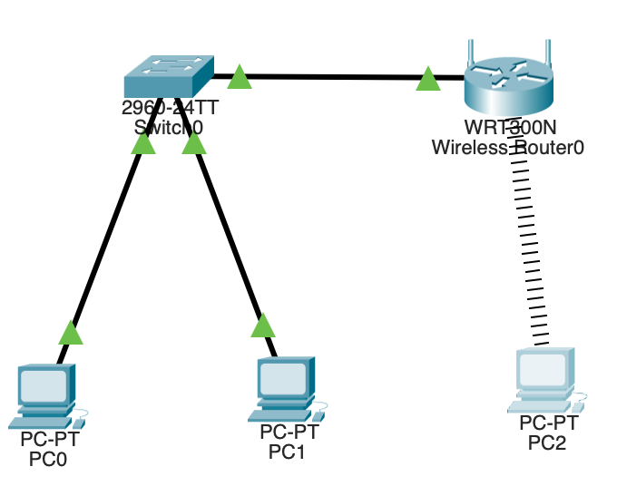

# **VLAN (Virtual Local Area Network)**

## **Definition**

* A **VLAN (Virtual Local Area Network)** is a **logical subdivision** of a physical network.
* It allows a single switch to be **logically divided into multiple smaller networks**, each acting as an independent LAN.
* Devices within the same VLAN can communicate directly, while communication between different VLANs requires a **router or Layer 3 switch**.

---

## **Purpose**

* To **segregate network traffic** for better performance, security, and management.
* To group users by **function or department**, not by physical location.
* To **reduce broadcast domains** — each VLAN acts as a separate broadcast domain.

---

## **Key Concepts**

| Term                   | Explanation                                                     |
| ---------------------- | --------------------------------------------------------------- |
| **Broadcast Domain**   | VLAN limits broadcast traffic within itself.                    |
| **Trunk Port**         | Carries multiple VLANs between switches using tagging.          |
| **Access Port**        | Connects end devices (like PCs) to a single VLAN.               |
| **VLAN ID**            | Unique number assigned to identify a VLAN (1–4094).             |
| **Inter-VLAN Routing** | Communication between VLANs through a router or Layer 3 switch. |

---

## **Advantages**

1. **Improved Security:** Traffic from one VLAN is isolated from others.
2. **Better Performance:** Reduces unnecessary broadcast traffic.
3. **Flexibility:** Users can be grouped logically regardless of location.
4. **Simplified Management:** Easier network configuration and maintenance.
5. **Efficient Resource Use:** Segments a large network into smaller, manageable parts.

---

## **Disadvantages**

1. **Complex Configuration:** Requires understanding of tagging and trunking.
2. **Inter-VLAN Routing Needed:** Communication between VLANs requires extra configuration.
3. **Misconfiguration Risks:** Wrong VLAN assignments can cause connectivity issues.

---

## **Types of VLANs**

1. **Default VLAN:** VLAN 1 – all switch ports belong to it by default.
2. **Data VLAN:** Used for user-generated data (e.g., VLAN 10 for HR).
3. **Voice VLAN:** Used for IP phone traffic.
4. **Management VLAN:** Used for switch management access (e.g., SSH, Telnet).
5. **Native VLAN:** Used for untagged traffic on trunk links.

---
## **Implementation of VLAN with Wireless Router Connection**

---

## **Aim**

To configure VLANs on a switch and integrate a wireless router to allow wireless connectivity in one VLAN, while maintaining VLAN isolation between wired networks.

---

## **Apparatus / Tools**

* Cisco Packet Tracer
* 1 × 2960-24TT Switch
* 1 × Wireless Router (WRT300N or similar)
* 2 × PCs (wired)
* 1 × Laptop (with WPC300N wireless module)

---

## **IP Addressing Table**

| Device           | Interface     | VLAN | IP Address   | Subnet Mask   | Gateway      |
| ---------------- | ------------- | ---- | ------------ | ------------- | ------------ |
| Wireless Router0 | LAN           | 10   | 192.168.10.1 | 255.255.255.0 | —            |
| PC0              | FastEthernet0 | 10   | DHCP         | 255.255.255.0 | 192.168.10.1 |
| PC1              | FastEthernet0 | 20   | 192.168.20.2 | 255.255.255.0 | 192.168.20.1 |
| Laptop           | Wireless      | 10   | DHCP         | 255.255.255.0 | 192.168.10.1 |

---

## **Step-by-Step Configuration**

### **1. Switch Configuration**

Open **Switch0 → CLI** and enter:

```bash
enable
configure terminal

vlan 10
 name Admin
vlan 20
 name Sales
exit
```

Assign VLANs to switch ports:

```bash
interface fastEthernet0/1
 switchport mode access
 switchport access vlan 10
exit

interface fastEthernet0/2
 switchport mode access
 switchport access vlan 20
exit

interface fastEthernet0/3
 switchport mode access
 switchport access vlan 10
exit

end
write
```

**Connections:**

* PC0 → F0/1
* PC1 → F0/2
* Wireless Router (LAN port) → F0/3

---

### **2. Wireless Router Configuration**

Open **Wireless Router0 → Config Tab**

#### **A. Internet Tab**

* Select: **DHCP** (automatic)

#### **B. LAN Tab**

```
IP Address: 192.168.10.1
Subnet Mask: 255.255.255.0
```

#### **C. Wireless Tab**

```
SSID: VLAN10-WiFi
Authentication: WPA2-PSK
PSK Pass Phrase: 12345678
```

#### **D. DHCP Configuration (GUI Tab → Network Setup)**

```
DHCP Server: Enabled
Start IP Address: 192.168.10.2
Maximum Users: 50
Static DNS: 8.8.8.8
```

---

### **3. End Devices Configuration**

#### **PC0 (VLAN 10)**

* Connection: Switch F0/1
* IP Configuration: **DHCP**

#### **PC1 (VLAN 20)**

* Connection: Switch F0/2
* IP Configuration: **Static**

  ```
  IP: 192.168.20.2
  Subnet Mask: 255.255.255.0
  Gateway: 192.168.20.1
  ```

#### **Laptop (VLAN 10 – Wireless)**

* Add **WPC300N module** in the **Physical tab**.
* Go to **Desktop → PC Wireless → Connect**

  ```
  SSID: VLAN10-WiFi
  Password: 12345678
  ```
* IP Configuration: **DHCP**

---

## **4. Verification Commands**

### **A. Check VLAN Configuration (on Switch CLI)**

```bash
show vlan brief
```

Expected:

```
VLAN10 - Fa0/1, Fa0/3
VLAN20 - Fa0/2
```

---

### **B. Check IP Addresses (on PCs)**

```bash
ipconfig
```

Confirms IP assignment by DHCP or static.

---

### **C. Ping Tests**

| Test            | Command                       | Expected Result                     |
| --------------- | ----------------------------- | ----------------------------------- |
| PC0 → Router    | `ping 192.168.10.1`           | Successful                          |
| Laptop → Router | `ping 192.168.10.1`           | Successful                          |
| PC0 → Laptop    | `ping 192.168.10.3` (DHCP IP) | Successful                          |
| PC1 → PC0       | `ping 192.168.10.x`           | Request timed out (different VLANs) |

---

## **5. Results**

* VLAN 10 (wired + wireless) devices communicate successfully.
* VLAN 20 remains isolated.
* DHCP works via Wireless Router.
* Wireless clients get connected using SSID VLAN10-WiFi.

---
