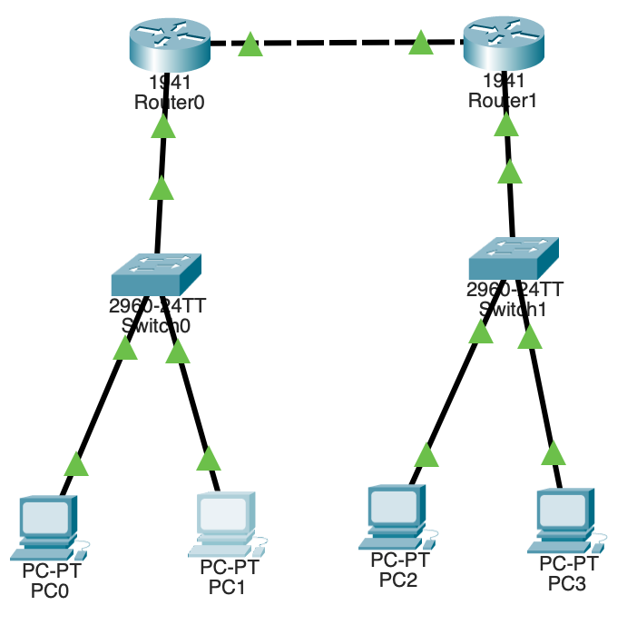

# Static Routing

## What is Static Routing?

* A routing method where **routes are manually configured** by an administrator on routers.
* The router **does not learn or adjust** routes automatically; it forwards packets strictly per the configured routes.
* Used to define **fixed, deterministic paths** between networks.

## Key Characteristics

* **Manual configuration**: Admin enters destination network, subnet mask, and next-hop (or exit interface).
* **No routing protocol** overhead (no hello/LSA/updates).
* **Predictable** behavior; routing table changes only when admin modifies it.
* **Resource-light**: minimal CPU/RAM and bandwidth usage.

## Advantages

* **Simplicity** for small/flat networks.
* **Low overhead** (no CPU/bandwidth spent on routing updates).
* **High security/control**: no unexpected path changes.
* **Deterministic**: good for **stub networks**, DMZs, static default routes, or backup paths.

## Disadvantages

* **No automatic failover**: if a link goes down, traffic is black-holed until admin intervenes (unless paired with tracking).
* **Poor scalability**: becomes **labor-intensive** in medium/large topologies.
* **Human error risk** in manual entries (wrong mask/next-hop).
* **No metric optimization**: cannot auto-choose best path.

## Common Use Cases

* **Small branch/stub networks** (single exit to HQ/Internet).
* **Default route to ISP** on edge routers.
* **Transit/point-to-point links** with stable paths.
* **Backup routes** (floating statics) behind a dynamic protocol.
* **Routing to static services** (e.g., management networks, loopbacks).

## Core Concepts

* **Next-Hop vs Exit Interface**:

  * Next-Hop IP (e.g., 10.0.0.2) tells the router where to send the packet.
  * Exit interface (e.g., G0/0) specifies the outgoing port (common on point-to-point links).
* **Default Route**: a catch-all for unknown destinations (0.0.0.0/0).
* **Floating Static**: a static route with **higher administrative distance** than a dynamic protocol, used as an **automatic backup**.
* **Administrative Distance (AD)**: trust value; lower is preferred (Static AD = 1; floating static uses higher AD like 5–254).


## Verification & Troubleshooting

* **Show routes**: `show ip route` (look for “S” entries for Static).
* **Test reachability**: `ping <ip>`, `traceroute <ip>`.
* **Check neighbors/ARP**: `show arp`, `show ip cef <ip>`.
* **Packet path**: `debug ip packet` (use with caution), or `show ip route <prefix>`.

## Best Practices

* Keep a **clean IP plan** (subnets, masks, next-hops documented).
* Use **default + a few specifics** to minimize entries.
* For resilience, deploy **floating statics** as backups to dynamic routing.
* Avoid recursive next-hop loops; ensure next-hop is reachable.
* On multiaccess networks, prefer **next-hop IP**; on p2p links, **exit interface** is fine.

---

## **1. Devices Required**

* 2 Routers (e.g., Cisco 1941)
* 2 Switches (e.g., 2960-24TT)
* 4 PCs
* Copper Straight-Through Cables (for PC ↔ Switch and Switch ↔ Router)
* Copper Cross-Over Cable (for Router ↔ Router link)

---

## **2. Network Topology**

**Left Side (Router0 LAN)**
→ `PC0`, `PC1` → `Switch0` → `Router0`

**Right Side (Router1 LAN)**
→ `PC2`, `PC3` → `Switch1` → `Router1`

Then connect **Router0 ↔ Router1** directly using **GigabitEthernet0/1** ports.

---

## **3. IP Addressing Scheme**

| Device      | Interface          | IP Address  | Subnet Mask     | Default Gateway |
| ----------- | ------------------ | ----------- | --------------- | --------------- |
| **Router0** | GigabitEthernet0/0 | 192.168.1.1 | 255.255.255.0   | —               |
| **Router0** | GigabitEthernet0/1 | 10.0.0.1    | 255.255.255.252 | —               |
| **Router1** | GigabitEthernet0/0 | 192.168.2.1 | 255.255.255.0   | —               |
| **Router1** | GigabitEthernet0/1 | 10.0.0.2    | 255.255.255.252 | —               |
| **PC0**     | FastEthernet0      | 192.168.1.2 | 255.255.255.0   | 192.168.1.1     |
| **PC1**     | FastEthernet0      | 192.168.1.3 | 255.255.255.0   | 192.168.1.1     |
| **PC2**     | FastEthernet0      | 192.168.2.2 | 255.255.255.0   | 192.168.2.1     |
| **PC3**     | FastEthernet0      | 192.168.2.3 | 255.255.255.0   | 192.168.2.1     |

---

## **4. Step-by-Step Configuration**

### **Step 1 – Connect Devices**

1. Connect PCs to switches using **Copper Straight-Through** cables.
2. Connect each switch to its respective router’s **GigabitEthernet0/0** port.
3. Connect **Router0 → Router1** using **GigabitEthernet0/1** (Cross-Over cable).

---

### **Step 2 – Configure Router0 Interfaces**

1. Click **Router0 → Config tab → Interface → GigabitEthernet0/0**

   * IP Address: `192.168.1.1`
   * Subnet Mask: `255.255.255.0`
   * Click **ON**.

2. Select **GigabitEthernet0/1**

   * IP Address: `10.0.0.1`
   * Subnet Mask: `255.255.255.252`
   * Click **ON**.

---

### **Step 3 – Configure Router1 Interfaces**

1. Click **Router1 → Config tab → Interface → GigabitEthernet0/0**

   * IP Address: `192.168.2.1`
   * Subnet Mask: `255.255.255.0`
   * Click **ON**.

2. Select **GigabitEthernet0/1**

   * IP Address: `10.0.0.2`
   * Subnet Mask: `255.255.255.252`
   * Click **ON**.

---

### **Step 4 – Configure Static Routing**

#### **On Router0:**

Go to → **Config → Routing → Static**

Fill in:

| Field        | Value           |
| ------------ | --------------- |
| **Network**  | `192.168.2.0`   |
| **Mask**     | `255.255.255.0` |
| **Next Hop** | `10.0.0.2`      |

Click **Add** 

---

#### **On Router1:**

Go to → **Config → Routing → Static**

Fill in:

| Field        | Value           |
| ------------ | --------------- |
| **Network**  | `192.168.1.0`   |
| **Mask**     | `255.255.255.0` |
| **Next Hop** | `10.0.0.1`      |

Click **Add**

---

### **Step 5 – Configure PCs**

Click each PC → **Desktop → IP Configuration**

#### **Left Side (Router0 LAN)**

| PC  | IP          | Subnet Mask   | Default Gateway |
| --- | ----------- | ------------- | --------------- |
| PC0 | 192.168.1.2 | 255.255.255.0 | 192.168.1.1     |
| PC1 | 192.168.1.3 | 255.255.255.0 | 192.168.1.1     |

#### **Right Side (Router1 LAN)**

| PC  | IP          | Subnet Mask   | Default Gateway |
| --- | ----------- | ------------- | --------------- |
| PC2 | 192.168.2.2 | 255.255.255.0 | 192.168.2.1     |
| PC3 | 192.168.2.3 | 255.255.255.0 | 192.168.2.1     |

---

## **5. Verification**

### **Check interface status:**

On each router → CLI tab:

```
show ip interface brief
```

All should show **“up/up”**.

---

### **Check routing table:**

```
Router1> exit
Router1> enable
Router1# show ip route

show ip route
```

* On Router0 → You should see: `S 192.168.2.0 [1/0] via 10.0.0.2`
* On Router1 → You should see: `S 192.168.1.0 [1/0] via 10.0.0.1`

---

### **Ping Test:**

From **PC0**, open Command Prompt:

```
ping 192.168.2.2
```

Successful reply = Static Routing working!

---
