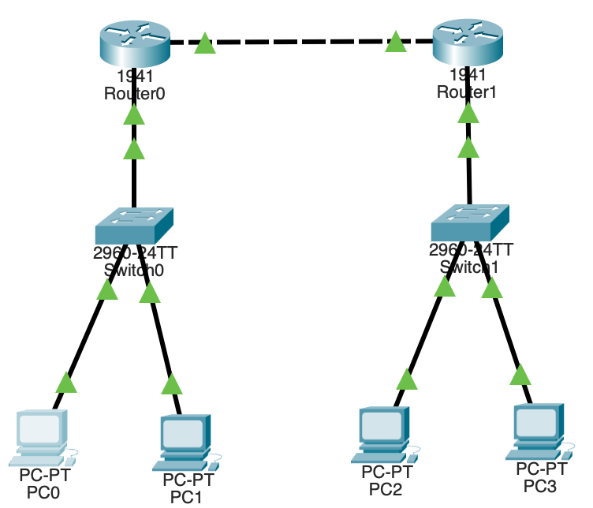

# **Dynamic Routing**

### **Definition**

- Dynamic routing is a technique in which **routers automatically learn, share, and update routes** to remote networks using **routing protocols**.
- Unlike **static routing**, routes are **not manually configured** — routers communicate with each other to build and maintain the routing table.
- It enables **automatic path selection** and **network adaptability** when topology changes occur.

---

### **Need for Dynamic Routing**

- In large or complex networks, manually adding static routes is **time-consuming and error-prone**.
- Dynamic routing provides **automatic route discovery**, **link-failure recovery**, and **efficient load balancing**.

---

### **Characteristics**

1. Routes are **learned and updated automatically**.
2. Uses **routing algorithms and protocols** to exchange information.
3. Periodic or triggered updates keep all routers synchronized.
4. Each router calculates the **best path** based on metrics (hop count, bandwidth, cost, delay, etc.).
5. The routing table is updated dynamically without manual intervention.

---

### **Types of Dynamic Routing Protocols**

| Type                 | Protocols   | Description                                                                                           |
| -------------------- | ----------- | ----------------------------------------------------------------------------------------------------- |
| **Distance Vector**  | RIP, IGRP   | Routers share routing tables with neighbors periodically. Uses hop count as metric.                   |
| **Link State**       | OSPF, IS-IS | Routers exchange full topology information and compute shortest paths using algorithms like Dijkstra. |
| **Hybrid**           | EIGRP       | Combines distance-vector and link-state features; faster and more efficient.                          |
| **Exterior Gateway** | BGP         | Used for routing between different autonomous systems (Internet level).                               |

---

### **Advantages**

- **Automatic updates** — no manual configuration needed.
- **Scalable** for large networks.
- **Adaptive** to topology or link failures.
- **Efficient path selection** based on metrics.
- **Load balancing** possible across multiple paths.

---

### **Disadvantages**

- Consumes **more CPU, memory, and bandwidth** due to updates.
- Slightly **slower convergence** compared to static routing.
- **Complex configuration** for large protocols.
- Possibility of **routing loops** if timers and updates are mismanaged.

---

### **Examples of Dynamic Routing Protocols**

| Protocol                                               | Type             | Metric            | Administrative Distance | Use Case                |
| ------------------------------------------------------ | ---------------- | ----------------- | ----------------------- | ----------------------- |
| **RIP (Routing Information Protocol)**                 | Distance Vector  | Hop Count         | 120                     | Small networks          |
| **OSPF (Open Shortest Path First)**                    | Link State       | Cost              | 110                     | Medium/Large enterprise |
| **EIGRP (Enhanced Interior Gateway Routing Protocol)** | Hybrid           | Bandwidth & Delay | 90                      | Cisco networks          |
| **BGP (Border Gateway Protocol)**                      | Exterior Gateway | Path Attributes   | 20 (external)           | ISP-to-ISP routing      |

---

### **Working Principle**

1. Routers exchange **Hello** or **Update** messages to discover neighbors.
2. Each router builds a **topology database** of reachable networks.
3. A **routing algorithm** computes the best path (lowest metric).
4. The **routing table** is updated automatically.
5. If a route fails, routers recompute and propagate updates to others.

---

# Dynamic Routing Configuration (RIP) – Cisco Packet Tracer

---

## Apparatus

- 2 Routers (Cisco 1941)
- 2 Switches (Cisco 2960)
- 4 PCs
- Straight-through and crossover cables
- Cisco Packet Tracer software

---

## Network Topology

---

## IP Addressing Table

| Device  | Interface | IP Address  | Subnet Mask     | Default Gateway |
| ------- | --------- | ----------- | --------------- | --------------- |
| Router0 | G0/0      | 192.168.1.1 | 255.255.255.0   | -               |
| Router0 | G0/1      | 10.0.0.1    | 255.255.255.252 | -               |
| Router1 | G0/0      | 192.168.2.1 | 255.255.255.0   | -               |
| Router1 | G0/1      | 10.0.0.2    | 255.255.255.252 | -               |
| PC0     | Fa0       | 192.168.1.2 | 255.255.255.0   | 192.168.1.1     |
| PC1     | Fa0       | 192.168.1.3 | 255.255.255.0   | 192.168.1.1     |
| PC2     | Fa0       | 192.168.2.2 | 255.255.255.0   | 192.168.2.1     |
| PC3     | Fa0       | 192.168.2.3 | 255.255.255.0   | 192.168.2.1     |

---

## Procedure

### Step 1: Device Connections

- Connect PCs to switches using straight-through cables.
- Connect each switch to its router using straight-through cables.
- Connect Router0 and Router1 using a crossover cable (G0/1 ↔ G0/1).

---

### Step 2: Configure Interfaces

**Router0**

```
Interface G0/0 → IP 192.168.1.1 255.255.255.0
Interface G0/1 → IP 10.0.0.1 255.255.255.252
Turn both interfaces ON
```

**Router1**

```
Interface G0/0 → IP 192.168.2.1 255.255.255.0
Interface G0/1 → IP 10.0.0.2 255.255.255.252
Turn both interfaces ON
```

---

### Step 3: Configure RIP (Dynamic Routing)

**Router0 → Config → Routing → RIP**

```
Add:
192.168.1.0
10.0.0.0
```

**Router1 → Config → Routing → RIP**

```
Add:
192.168.2.0
10.0.0.0
```

This enables both routers to exchange route information automatically.

---

### Step 4: Configure PCs

Assign IPs and gateways as per the IP table above using Desktop → IP Configuration.

---

### Step 5: Verification

**1. On Routers (CLI):**

```
show ip route
```

Expected Output:

- Router0: R 192.168.2.0 [120/1] via 10.0.0.2
- Router1: R 192.168.1.0 [120/1] via 10.0.0.1

**2. On PC:**

```
ping 192.168.2.2
```

Ping reply indicates successful routing.

---
