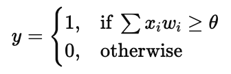

## **McCulloch–Pitts Neural Model (MP Neuron)**

### **Theory**

* Proposed by **Warren McCulloch** and **Walter Pitts** in **1943**, it is the **first mathematical model of an artificial neuron**.
* It is a **binary threshold model**, meaning the neuron outputs **1 (fire)** or **0 (no fire)** based on a weighted sum of its inputs.
* The neuron simulates the logical behavior of biological neurons using **simple arithmetic and thresholding**.

---

### **Structure**

* **Inputs (x₁, x₂, ..., xₙ):** Binary signals (0 or 1).
* **Weights (w₁, w₂, ..., wₙ):** Strength of each input connection.
* **Summation Unit:** Calculates the total input (Σ xᵢ wᵢ).
* **Threshold (θ):** Fixed limit to decide activation.
* **Activation Function:** 

---

### **Logic Gate Simulation**

| Gate | Weights        | Threshold | Logic                         |
| ---- | -------------- | --------- | ----------------------------- |
| AND  | w₁ = 1, w₂ = 1 | θ = 2     | Fires only if both inputs = 1 |
| OR   | w₁ = 1, w₂ = 1 | θ = 1     | Fires if either input = 1     |
| NOT  | w = –1         | θ = 0     | Inverts the input             |

---

### **Characteristics**

1. **Binary output:** Only 0 or 1 (no intermediate values).
2. **Fixed weights and threshold:** Learning not included (static model).
3. **Implements Boolean logic:** AND, OR, NOT, NAND, NOR, XOR, etc.
4. **Basis for perceptron:** MP neuron is the foundation of modern neural networks.
5. **No learning mechanism:** Parameters are manually set.

---

### **Advantages**

* Simple and easy to implement.
* Demonstrates the concept of neuron firing and thresholding.
* Can realize all basic logic gates.

### **Disadvantages**

* Cannot solve **non-linear** problems like XOR directly.
* Only binary inputs/outputs, no real-valued operations.
* No ability to learn or adjust weights automatically.
