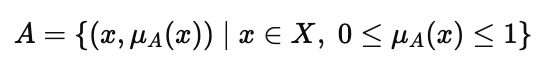
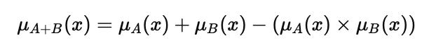

### **Theory**

Fuzzy set theory extends classical set theory by allowing elements to have **degrees of membership** between **0 and 1**, rather than being restricted to only 0 (not a member) or 1 (member).
Each fuzzy set is represented as

where **μA(x)** denotes the **membership value** of element *x* in set *A*.

Fuzzy operations generalize classical set operations by using **min**, **max**, and **complement** functions on membership grades.

---

### **1. Union (A ∪ B)**

Represents the degree to which an element belongs to **either A or B**.

**Interpretation:** Take the higher membership value between A and B.

---

### **2. Intersection (A ∩ B)**

Represents the degree to which an element belongs to **both A and B**.

**Interpretation:** Take the smaller membership value of the two sets.

---

### **3. Complement (¬A)**

Shows the degree to which an element **does not belong** to set A.

**Interpretation:** Inverts the membership grade of A.

---

### **4. Algebraic Product (A · B)**

Represents a **t-norm** operation that multiplies memberships to express simultaneous truth.

**Interpretation:** Models the fuzzy “AND” operation.

---

### **5. Algebraic Sum (A + B)**

Represents a **t-conorm** operation showing the combined membership of A and B.

**Interpretation:** Models the fuzzy “OR” operation.

---

### **Key Characteristics**

* Membership values lie between **0 and 1**.
* All operations preserve fuzzy logic principles.
* Used in fuzzy control systems, pattern recognition, and decision-making.

---

### **Advantages**

* Handles **uncertainty and partial truth** effectively.
* Offers flexible reasoning compared to crisp sets.
* Provides a smooth transition between full membership and non-membership.

### **Disadvantages**

* Depends heavily on the **choice of membership functions**.
* More **computationally intensive** than classical logic.
* Interpretation of fuzzy results can be subjective.
