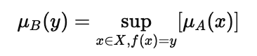

## **Theory: Fuzzy Extension Principle**

The **Fuzzy Extension Principle** is a fundamental concept introduced by *Lotfi A. Zadeh (1975)* to extend classical mathematical functions to operate on **fuzzy sets** instead of crisp numbers.

It defines how a function ( f: X -> Y ) transforms a fuzzy set **A** on domain **X** into a fuzzy set **B** on range **Y**.

---

### **Mathematical Definition**

If a fuzzy set **A** is defined on **X** with membership function ( μA(x) ),
then the resulting fuzzy set **B = f(A)** on **Y** is given by:

where **sup** denotes the *supremum* (maximum) of all membership values of x that map to y.

---

### **Concept Explanation**

* The **membership degree of y** in the output fuzzy set **B** is the **maximum membership** of all x values in **A** that produce y through function f(x).
* This allows fuzzy mappings like ( y = f(x) ) even when x is imprecise.
* In numerical applications, this is approximated using **discretization and interpolation**.

---

### **Steps for Implementation**

1. Define the fuzzy set **A(x)** with a known membership function.
2. Choose a transformation function **f(x)** (e.g., ( f(x) = x^2 )).
3. Compute output values ( y = f(x) ).
4. For each y, find all x that map close to it and take the **maximum μA(x)**.
5. Plot or print the resulting **μB(y)** — the fuzzy image of set A under f.

---

### **Applications**

* Used in **Fuzzy Control Systems** to extend crisp mathematical models.
* Helps in **decision making** and **approximate reasoning** when input data is uncertain.
* Forms the theoretical base for **ANFIS** and **Fuzzy Logic Controllers**.

---

### **Advantages**

* Extends classical functions to fuzzy domains.
* Preserves uncertainty information during transformation.
* Works for both analytical and numerical fuzzy models.

### **Disadvantages**

* Computationally expensive for large or continuous domains.
* Requires discretization and approximation in practical cases.

---
