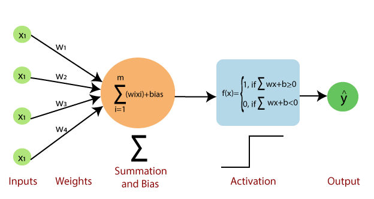
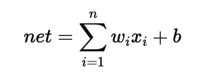
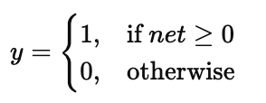
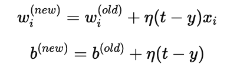

## **Theory: Perceptron Learning Model**

The **Perceptron** is the **simplest form of an Artificial Neural Network** and the foundation of modern machine learning models.
It was introduced by **Frank Rosenblatt (1958)** as a computational model inspired by how biological neurons process information.

---

### **1. Structure of a Perceptron**

A perceptron consists of:

* **Input Layer:** Accepts multiple inputs ( x_1, x_2, ..., x_n ).
* **Weights (w):** Each input is assigned a weight ( w_i ) that represents its importance.
* **Summation Function:** Computes the weighted sum
* 

  where ( b ) is the **bias**.
* **Activation Function:** Applies a step or sign function to decide the output:
* 

---

### **2. Learning Rule (Perceptron Training Algorithm)**

The perceptron **learns** by adjusting its weights to minimize classification errors.
The weight update rule is:

Where:

* ( \eta ) = Learning rate (0 < η ≤ 1)
* ( t ) = Target (expected output)
* ( y ) = Predicted output

Weights are updated repeatedly for all training samples until the error becomes zero or a maximum number of iterations is reached.

---

### **3. Working Steps**

1. Initialize weights and bias randomly (small values).
2. For each input pattern:

   * Compute weighted sum.
   * Apply activation function to get output.
   * Update weights using the perceptron learning rule.
3. Repeat until convergence (no misclassifications).

---

### **4. Example**

Used to classify **linearly separable** data like:

* AND, OR logic gates (works correctly).
* Cannot solve XOR (not linearly separable).

---

### **5. Advantages**

* Simple and easy to implement.
* Converges for linearly separable patterns.
* Forms the basis of multi-layer neural networks.

### **6. Disadvantages**

* Fails for non-linear data (e.g., XOR).
* Fixed learning rate may slow convergence.
* Only binary output (0 or 1).

---

### **7. Applications**

* Pattern recognition
* Binary classification
* Image and speech recognition (foundation for deep networks)

---

### **Conclusion**

The **Perceptron Learning Model** demonstrates how a simple neuron can learn to classify input patterns using weight adjustment.
Although limited to linearly separable problems, it forms the **building block for modern neural networks** like MLPs and CNNs.
