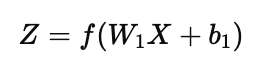
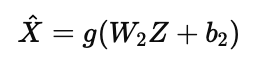
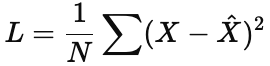

## **Theory: Autoencoder Neural Network**

An **Autoencoder** is an **unsupervised neural network** model used to learn compressed, efficient representations of data.
Its main goal is to **reconstruct its input** as accurately as possible after encoding it into a lower-dimensional latent space.

---

### **1. Structure and Working**

An autoencoder consists of three main parts:

1. **Encoder:**
   Compresses input data ( X ) into a smaller latent representation ( Z ).
  

   where ( f ) is a nonlinear activation (like ReLU or sigmoid).

2. **Latent Space (Code):**
   The compressed intermediate feature space that captures essential data patterns.

3. **Decoder:**
   Reconstructs the original input from the latent code.
 

   The output ( \hat{X} ) is compared to ( X ), and the **reconstruction error** is minimized.

---

### **2. Learning Principle**

* **Loss Function:**
  Mean Squared Error (MSE) between input and reconstructed output:
 

* The network learns to minimize this loss using **gradient descent** (TensorFlow) or **back-propagation** (MLPRegressor internally).

---

### **3. Implementation Approaches**

#### **A) TensorFlow / Keras Autoencoder**

* Explicitly defines encoder and decoder layers using `Dense` layers.
* Allows flexible control over architecture, activations, and latent dimensions.
* Trained using `optimizer='adam'` and `loss='mse'`.
* Provides access to latent codes and reconstructions separately.

#### **B) Scikit-Learn Autoencoder (MLPRegressor)**

* Uses a **multi-layer perceptron regressor** to map ( X -> X ).
* Hidden layers form an implicit encoder–decoder structure (e.g., 4-8-2-8-4).
* Requires minimal code and no deep-learning library.
* Optimized automatically using the Adam solver.

Both achieve the same goal — **reconstruct input data while learning its low-dimensional features**.

---

### **4. Applications**

* Dimensionality reduction (alternative to PCA)
* Noise removal (denoising autoencoders)
* Feature extraction for classification
* Image compression and reconstruction
* Anomaly or outlier detection

---

### **5. Advantages**

* Learns nonlinear feature representations automatically.
* Reduces dimensionality without manual feature engineering.
* Easy to visualize 2D or 3D latent spaces.

### **6. Disadvantages**

* Requires sufficient training data.
* Sensitive to network architecture and learning rate.
* May overfit if latent dimension is too large.

---

### **Conclusion**

Autoencoders demonstrate how neural networks can **self-learn compact representations** of data through reconstruction.
The TensorFlow model provides full control and visualization, while the scikit-learn version offers a simpler, lightweight implementation of the same concept.
Both highlight the principle of **unsupervised feature learning** in modern AI.
