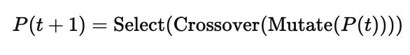

## **Theory**

A **Genetic Algorithm (GA)** is a population-based **optimization and search technique** inspired by the process of **natural evolution**.
It works on a set of possible solutions called a *population* and uses **selection**, **crossover**, and **mutation** operators to evolve better solutions over generations.

---

### **Basic Concepts**

1. **Chromosome:**
   A string representing a candidate solution (e.g., binary string `1010011101`).

2. **Gene:**
   Each position (bit) in the chromosome that carries information about the solution.

3. **Population:**
   A group of chromosomes evaluated together in each generation.

4. **Fitness Function:**
   Quantifies how good each solution is; higher fitness means a better solution.

---

### **Algorithm Steps**

1. **Initialization:**
   Randomly generate an initial population of chromosomes.

2. **Fitness Evaluation:**
   Compute fitness for each chromosome (in One-Max, it is the number of 1s).

3. **Selection:**
   Choose parent chromosomes based on fitness probability (e.g., *Roulette Wheel Selection*).

4. **Crossover (Recombination):**
   Combine parts of two parents to produce new offspring (e.g., *Single-Point Crossover*).

5. **Mutation:**
   Randomly flip bits with a small probability to maintain diversity (*Bit-Flip Mutation*).

6. **Replacement:**
   The new population replaces the old one and the process repeats for several generations.

7. **Termination:**
   Stop when the best fitness is achieved or a maximum number of generations is reached.

---

### **Mathematical Expression**

Each generation ( t ) evolves towards higher fitness according to:

---

### **Applications**

* Function optimization
* Scheduling and planning
* Machine learning feature selection
* Neural network weight tuning
* Control system parameter optimization

---

### **Advantages**

* Works on large, complex, and nonlinear search spaces.
* Does not require derivative information.
* Provides near-optimal solutions through global search.

### **Disadvantages**

* Computationally expensive for large populations.
* Convergence can be slow.
* May get trapped in local optima if diversity is lost.

---
